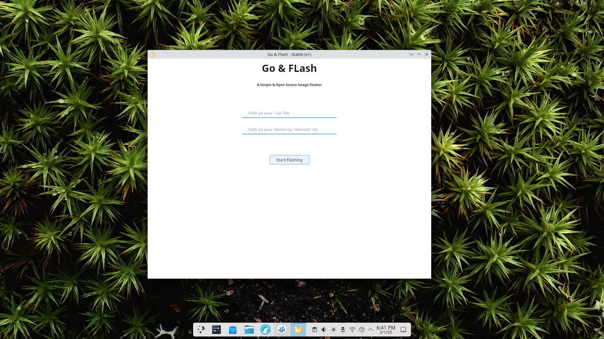

G&F - Go & FLash is a Simple , OpenSource Program which uses allows you to easily create the usb drives with a lot of ease by using both GUI and CLI as per your choise. It is purely written in C++ which uses `dd`, `umount`, `mkfs.ext4` commands for making the ISO, It not just FLashes the ISO Image Files but also allows you to format your `usb drives` with a lot of ease!.

## ➗Divisions
G&F is seperated into 2 parts :-
 - G&F
 - gnfc

**G&F** is the GUI based front end of the G&F which allow you to only flash iso files into usb sticks with proper guide and warnings and ease, It offers a very sleek & Modern User Interface for the end users to use it without having to worry about anything.

**gnfc** is the CLI based tool which allows you to create bootable usb flash drives, but also allows you to format usb sticks without having to dive deep in the mess of `umount` and `mkfs.ext4` and `dd` commands.

## 🔄Installation
Installing the `G&F` is very straight-forward but be sure that you have the following dependencies to be installed.

 - Magma
 - gtk3
 - webkit2gtk
 - umount
 - dd
 - mkfs.ext4

You can install magma by just pasting the following commands:
```bash
git clone https://github.com/darkyboys/magma.git
cd magma
mkdir bin
g++ src/main.cc -o bin/magma
echo "Magma is successfully builded at bin/"
echo ""
```

**Installing G&F**
For Now installing `GnF` Hoping that you already has all the dependencies use the following commands
```bash
git clone https://github.com/darkyboys/gnf.git
cf gnf
magma
```

## 📑Tutorial to use the G&F
For Using the `G&F` gui to make your front end please follow the following steps:-
Launching the G&F as sudo is required , because G&F requires sudo previllages to make changes on your USB Drive.

 - Launch the G&F as sudo
 - First In the Section where Image Path is asked , Add the full path to your image starting like this /home/usr/x
 - Then enter the device name where your usb is plugged in eg `/dev/sdX`. Use lsblk or fdisk for this.
 - Click the start button
 - Confirm your entries
 - Wait until the progress reaches 100% and finishes, During this the GUI Will become frozen but don't try to close it , It becomes frozen to prevent any changes to the entries so it may take a bit longer depending on your drive speed and image size.

Congratulations you now has the bootable flash drive!

## 📑Tutorial to use the gnfc
`gnfc` is the CLI frontend which allows you to not just make bootable usb flash drives but also allows you to format the USB Drives. 

Here are the commands which can be used with `gnfc`

 - --version : This command shows the version of the gnfc installation
 - --help    : This command shows the CLI based documentation of the gnfc
 - --format  : This command needs the drive path to format that drive , Be carefull while using this command as it erases entire disk.
 - --burn    : This command flashes an ISO image file to a device which then can become bootable , Be carefull while using this command as it erases entire disk.

**Usage Examples**
```bash
gnfc --version # This will show the current version
```

```bash
gnfc --help # This will show the current CLI Documentation
```

```bash
gnfc --format /dev/sdX # This will format the /dev/sdX device, Please replace the sdX with the actual name
```

```bash
gnfc --burn /home/usr/Downloads/myimage.iso /dev/sdX # This will flash the /home/usr/Downloads/myimage.iso to the /dev/sdX device, Please replace the placeholders with there actual names
```

*Note: Please don't close the program while process is in place for both GUI and CLI ends as it maymake your usb stick un-usable.*

## 🤝Contributing
Please checkout the <a href="CONTRIBUTING.md">Contribution Guidelines</a> for making a contribution.

## 🪲Bug Report
Open an issue then.

Project is under the MIT License

Thanks

Copyright (c) ghgltggamer 2025
Founded G&F at 1st Feb 2025